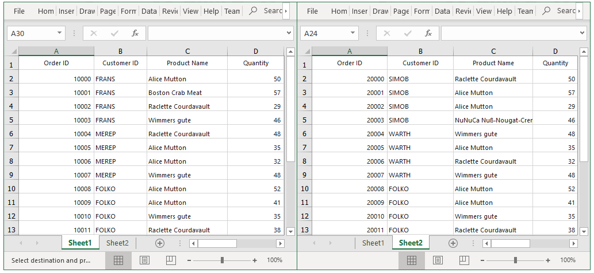

# How to export the multiple WPF DataGrid's (SfDataGrid's) into multiple worksheet in Excel?

## About the sample

This sample illustrates how to export the data from multiple SfDataGrid's to different worksheets in a same excel workbook.

In SfDataGrid, you can export the data to Excel by using the ExportToExcel method. 
You can also export the data from multiple SfDataGrid to different worksheets in a same workbook by passing the worksheet to which the data need to be exported as a parameter for the ExportToExcel method.

```c#
using Syncfusion.UI.Xaml.Grid.Converter;
using Syncfusion.XlsIO;
private static void OnExecuteExportToExcel(object sender, ExecutedRoutedEventArgs args)
{
    var dataGrid1 = args.Source as SfDataGrid;
    var dataGrid2 = args.Parameter as SfDataGrid;
    if (dataGrid1 == null) return;
    if (dataGrid2 == null) return;
    try
    {
        var options = new ExcelExportingOptions();
        options.ExcelVersion = ExcelVersion.Excel2010;
        options.ExportingEventHandler = ExportingHandler;
        ExcelEngine excelEngine = new ExcelEngine();
        IWorkbook workBook = excelEngine.Excel.Workbooks.Create();
        dataGrid1.ExportToExcel(dataGrid1.View, options, workBook.Worksheets[0]);
        dataGrid2.ExportToExcel(dataGrid2.View, options, workBook.Worksheets[1]);

        // Saving the workbook.
        workBook.SaveAs("sample.xlsx");
    }
    catch (Exception ex)
    {
        MessageBox.Show(ex.Message);
    }
}

```



## Requirements to run the demo
Visual Studio 2015 and above versions
